<!-- CHAPTER 4: BUILDING USER INTERFACES -->
# Chapter 4: Building User Interfaces

## Key Concepts

- **User Interface (UI):** The visual elements and interactive components that users interact with in an application.
- **Android UI Design:** Introduces new terminology, UI controls, widgets, and layout managers.

***

### Android Terminology

- **Views:** The base class for all interface elements.
- **View Groups:** Extensions of the View class that contain multiple child Views.
- **Activities:** Represent a displayed window or screen.(To display UI)
- **Fragments:** Mini-activities within an Android app, allowing reusable UI pieces.

***

### Visual Illustration

#### Summary in Mind Map

Show Mind Map

  

#### Views Hierarchy

Show Views Hierarchy

> [Image Source for Views Hierarchy](https://www.usna.edu/Users/cs/adina/teaching/it472/spring2021/course/page.php?shortname=mobileos&id=5#hierarchy)

#### View Groups

Show View Groups

> [Image Source for View Groups](http://developer.android.com/images/viewgroup.png)

#### Activities

Show Activities

> [Image Source for Activities](https://www.tutorialspoint.com/android/android_acitivities.htm)

#### Fragments

Show Fragments

> [Image Source for Fragments](https://www.tutorialspoint.com/android/android_fragments.htm)
